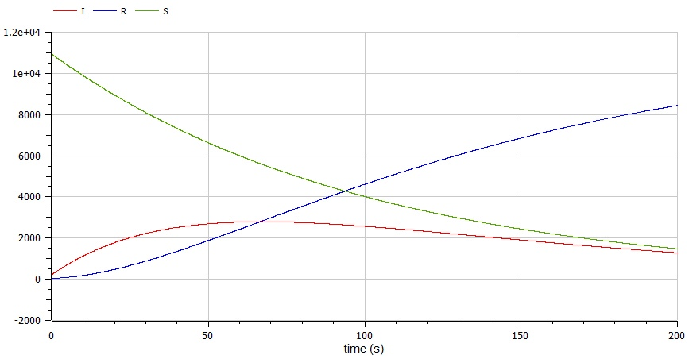

---
# Front matter
lang: ru-RU
title: Защита лабораторной работы №6. Модель эпидемии SIR
author: "Бурдина Ксения Павловна"
group: NFIbd-01-19
institute: RUDN University, Moscow, Russian Federation
date: 2022 Mar 15th

# Formatting
toc: false
slide_level: 2
header-includes: 
 - \metroset{progressbar=frametitle,sectionpage=progressbar,numbering=fraction}
 - '\makeatletter'
 - '\beamer@ignorenonframefalse'
 - '\makeatother'
aspectratio: 43
section-titles: true
theme: metropolis

---

# Результат выполнения лабораторной работы №6

# Цель выполнения лабораторной работы 

## Цель выполнения лабораторной работы

Необходимо научиться выполнять построение математической модели эпидемии SIR. Нужно рассмотреть задачу об изменении числа особей в трёх возможных группах с течением времени.

# Задачи выполнения лабораторной работы

## Задачи выполнения лабораторной работы

1. Провести рассуждения и записать дифференциальные уравнения изменения численности здоровых, заболевших и восприимчивых к болезни особей;

2. Построить график изменения числа особей в каждой их трёх групп для случая, когда $I(0) \leqslant I^*$;

3. Построить график изменения числа особей в каждой их трёх групп для случая, когда $I(0) > I^*$.

# Уравнения

## Уравнения

Коэффициенты для решения уравнений:

$$a = 0.01, b = 0.02$$
$$N = 11200$$

Начальные условия:
$$\left\{ 
\begin{array}{c}
I0 = 230 \\
R0 = 45 \\
S0 = N-I(0)-R(0) \\
\end{array}
\right.$$

## Уравнения

Cистема уравнений изменения численности для случая 1:
$$\left\{ 
\begin{array}{c}
\frac{dS}{dt} = 0 \\ 
\frac{dI}{dt} = - 0.02*I \\
\frac{dR}{dt} = 0.02*I \\
\end{array}
\right.$$

Cистема уравнений изменения численности для случая 2:
$$\left\{ 
\begin{array}{c}
\frac{dS}{dt} = - 0.01*S \\ 
\frac{dI}{dt} = 0.01*S - 0.02*I \\
\frac{dR}{dt} = 0.02*I \\
\end{array}
\right.$$

# Результат выполнения лабораторной работы

## Результат выполнения лабораторной работы

Модель изменения числа особей в случае, когда $I(0) \leqslant I^*$:

{width=80%}

## Результат выполнения лабораторной работы

Модель изменения числа особей в случае, когда $I(0)>I^*$:

{width=80%}

# Вывод

## Вывод

- Провели рассуждения и выполнили построение математической модели эпидемии SIR для решения задачи;

-  Получили дифференциальные уравнения, на основе которых решили задачу об изменении числа особей со временем;

- Построили графики изменения числа особей для трёх групп в случаях, когда $I(0) \leqslant I^*$ и когда $I(0)>I^*$.

