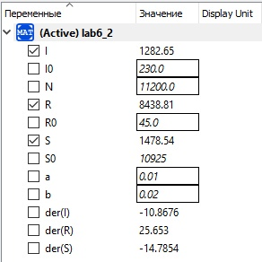

---
# Front matter
title: "Отчет по лабораторной работе №6"
subtitle: "Модель SIR"
author: "Бурдина Ксения Павловна"
group: NFIbd-01-19
institute: RUDN University, Moscow, Russian Federation
date: 2022 Mar 15th

# Generic otions
lang: ru-RU
toc-title: "Содержание"

# Bibliography
csl: pandoc/csl/gost-r-7-0-5-2008-numeric.csl

# Pdf output format
toc: true # Table of contents
toc_depth: 2
lof: true # List of figures
lot: true # List of tables
fontsize: 12pt
linestretch: 1.5
papersize: a4
documentclass: scrreprt
### Fonts
mainfont: PT Serif
romanfont: PT Serif
sansfont: PT Sans
monofont: PT Mono
mainfontoptions: Ligatures=TeX
romanfontoptions: Ligatures=TeX
sansfontoptions: Ligatures=TeX,Scale=MatchLowercase
monofontoptions: Scale=MatchLowercase,Scale=0.9
## Biblatex
biblatex: true
biblio-style: "gost-numeric"
biblatexoptions:
  - parentracker=true
  - backend=biber
  - hyperref=auto
  - language=auto
  - autolang=other*
  - citestyle=gost-numeric
## Misc options
indent: true
header-includes:
  - \linepenalty=10 # the penalty added to the badness of each line within a paragraph (no associated penalty node) Increasing the value makes tex try to have fewer lines in the paragraph.
  - \interlinepenalty=0 # value of the penalty (node) added after each line of a paragraph.
  - \hyphenpenalty=50 # the penalty for line breaking at an automatically inserted hyphen
  - \exhyphenpenalty=50 # the penalty for line breaking at an explicit hyphen
  - \binoppenalty=700 # the penalty for breaking a line at a binary operator
  - \relpenalty=500 # the penalty for breaking a line at a relation
  - \clubpenalty=150 # extra penalty for breaking after first line of a paragraph
  - \widowpenalty=150 # extra penalty for breaking before last line of a paragraph
  - \displaywidowpenalty=50 # extra penalty for breaking before last line before a display math
  - \brokenpenalty=100 # extra penalty for page breaking after a hyphenated line
  - \predisplaypenalty=10000 # penalty for breaking before a display
  - \postdisplaypenalty=0 # penalty for breaking after a display
  - \floatingpenalty = 20000 # penalty for splitting an insertion (can only be split footnote in standard LaTeX)
  - \raggedbottom # or \flushbottom
  - \usepackage{float} # keep figures where there are in the text
  - \floatplacement{figure}{H} # keep figures where there are in the text
---

# Цель работы

Целью данной работы является построение математической модели SIR на примере задачи об эпидемии.

# Задание

В ходе работы необходимо:

1. Прописать уравнения для построения модели SIR изменения численности здоровых, заболевших и восприимчивых к болезни особей при условии, что общее число проживающих на острове $N = 11200$.

2. Построить график изменения числа особей в каждой их трех групп в случае, если $I(0) \leqslant I^*$.

3. Построить график изменения числа особей в каждой их трех групп в случае, если $I(0) > I^*$.

# Теоретическое введение

Постановка задачи следующая:

На одном острове вспыхнула эпидемия. Известно, что из всех проживающих на острове ($N=11200$) в момент начала эпидемии ($t=0$) число заболевших людей, являющихся распространителями инфекции, $I(0)=230$, а число здоровых людей с иммунитетом к болезни $R(0)=45$. Таким образом, число людей, восприимчивых к болезни, но пока здоровых, в начальный момент времени  $S(0)=N-I(0)- R(0)$.

Решение исходной задачи сводится к решению системы дифференциальных уравнений: 

$$\left\{ 
\begin{array}{c}
\frac{dS}{dt} = 0 \\ 
\frac{dI}{dt} = - 0.02*I \\
\frac{dR}{dt} = 0.02*I \\
\end{array}
\right.$$

в случае, когда $I(0) \leqslant I^*$ и

$$\left\{ 
\begin{array}{c}
\frac{dS}{dt} = - 0.01*S \\ 
\frac{dI}{dt} = 0.01*S - 0.02*I \\
\frac{dR}{dt} = 0.02*I \\
\end{array}
\right.$$

в случае, когда $I(0) > I^*$, с начальными условиями:

$$\left\{ 
\begin{array}{c}
I(0) = 230 \\ 
R(0) = 45 \\
S(0) = N-I(0)-R(0) \\ 
\end{array}
\right.$$

# Выполнение лабораторной работы

1. Рассмотрим простейшую модель эпидемии. Предположим, что некая популяция, состоящая из $N$ особей, подразделяется на три группы. Первая группа - это восприимчивые к болезни, но пока здоровые особи, обозначим их через $S(t)$. Вторая группа – это число инфицированных особей, которые также при этом являются распространителями инфекции, обозначим их $I(t)$. А третья группа, обозначающаяся через $R(t)$ – это здоровые особи с иммунитетом к болезни.

2. Определим переменную $I^*$ как критическое значение инфицированных особей. До того момента, как число заболевших не превышает данного критического значения, считаем, что все больные изолированы и не заражают здоровых. Когда $I(t)>I^*$, тогда инфицирование способны заражать восприимчивых к болезни особей.

3. Определим уравнение, описывающее скорость изменения числа здоровых, но восприимчивых к болезни особей $S(t)$ [[1]](https://esystem.rudn.ru/pluginfile.php/1343897/mod_resource/content/2/%D0%9B%D0%B0%D0%B1%D0%BE%D1%80%D0%B0%D1%82%D0%BE%D1%80%D0%BD%D0%B0%D1%8F%20%D1%80%D0%B0%D0%B1%D0%BE%D1%82%D0%B0%20%E2%84%96%205.pdf). Оно имеет следующий вид:

$$\left\{ 
\begin{array}{c}
\frac{dS}{dt} = -\alpha S, I(t)>I^* \\ 
\frac{dS}{dt} = 0, I(t)\leqslant I^* \\ 
\end{array}
\right.$$

где $\alpha$ - коэффициент заболеваемости.

Можно понять, что каждая восприимчивая к болезни особь, которая в какой-то момент тоже заболевает, сама становится инфекционной. Из этого следует, что скорость изменения числа инфекционных особей представляет разность за единицу времени между заразившимися и теми, кто уже болеет и лечится. Поэтому уравнение, описывающее изменение числа инфицированных и заражающих других особей, будет выглядеть так:

$$\left\{ 
\begin{array}{c}
\frac{dI}{dt} = \alpha S - \beta I, I(t)>I^* \\ 
\frac{dI}{dt} = -\beta I, I(t)\leqslant I^* \\ 
\end{array}
\right.$$

при условии, что $\alpha$ - коэффициент заболеваемости, $\beta$ - коэффициент выздоровления.

Есть еще одна группа особей - выздоравливающие и приобретающие иммунитет к болезни. Уравнение, описывающее скорость изменения численности данной группы особей имеет следующий вид:

$$\frac{dR}{dt} = \beta I$$

где $\beta$ - это, соответственно, коэффициент выздоровления.

4. Для однозначного решения соответствующих уравнений необходимо задать начальные условия. Считаем, что на начало эпидемии в момент времени $t_0$ особи с иммунитетом к болезни составляют $R(0)=45$, а число инфицированных и восприимчивых к болезни особей определяется как $I(0) = 230$ и $S(0) = N-I(0)-R(0)$ соответственно. 

    Для анализа картины протекания эпидемии рассмотрим два случая:

    1. Когда $I(0) \leqslant I^*$
    2. Когда $I(0)>I^*$

5. Напишем программу для расчёта изменения числа особей в каждой из трёх групп в OpenModelica. Зададим начальное состояние системы:
$$I0 = 230$$
$$R0 = 45$$
$$S0 = N-I0-R0$$

Запишем параметры для решения системы: $$a = 0.01, b = 0.02, N = 11200$$

Установим, что переменные $I, R, S$ имеют начальные значения $I0, R0, S0$ соответственно. Запишем уравнения, описывающие нашу модель, для первого случая, когда $I(t)\leqslant I^*$:
$$der(S) = 0$$
$$der(I) = -b*I$$
$$der(R) = b*I$$

{width=80%}

{width=60%}

Установим, что промежуток времени, на котором мы рассматриваем изменение численности: $t \in [0:200]$, а шаг составляет $0.01$

В результате выполнения данной программы получаем следующий график изменения числа особей в каждой из трёх групп при условии, что $I(t)\leqslant I^*$:

6. Напишем программу для расчёта изменения числа особей в каждой из трёх групп для второго случая. Начальное состояние системы остаётся прежним:
$$I0 = 230$$
$$R0 = 45$$
$$S0 = N-I0-R0$$

Параметры для решения системы также сохраняются с первого случая: $$a = 0.01, b = 0.02, N = 11200$$

Переменные $I, R, S$ имеют начальные значения $I0, R0, S0$ соответственно. Уравнения, описывающие нашу модель, для второго случая, когда $I(t)>I^*$:
$$der(S) = -a*S$$
$$der(I) = a*S-b*I$$
$$der(R) = b*I$$

{width=80%}

{width=60%}

В результате выполнения данной программы получаем следующий график изменения числа особей в каждой из трёх групп при условии, что $I(t)>I^*$:

# Выводы

В процессе выполнения работы мы построили модель SIR на примере задачи об эпидемии. Получили дифференциальные уравнения для построения модели изменения численности здоровых, заболевших и восприимчивых к болезни особей с учетом начального состояния системы для двух случаев. Построили график изменения числа особей в каждой их трех групп для случая, когда $I(0) \leqslant I^*$, а также для случая, когда $I(0) > I^*$.

# Список литературы

1. Методические материалы курса "Математическое моделирование" [[1]](https://esystem.rudn.ru/pluginfile.php/1343897/mod_resource/content/2/%D0%9B%D0%B0%D0%B1%D0%BE%D1%80%D0%B0%D1%82%D0%BE%D1%80%D0%BD%D0%B0%D1%8F%20%D1%80%D0%B0%D0%B1%D0%BE%D1%82%D0%B0%20%E2%84%96%205.pdf).

2. Применение SIR модели в моделировании эпидемий. Электронный справочник: [[2]](https://cyberleninka.ru/article/n/primenenie-sir-modeli-v-modelirovanii-epidemiy/viewer).
